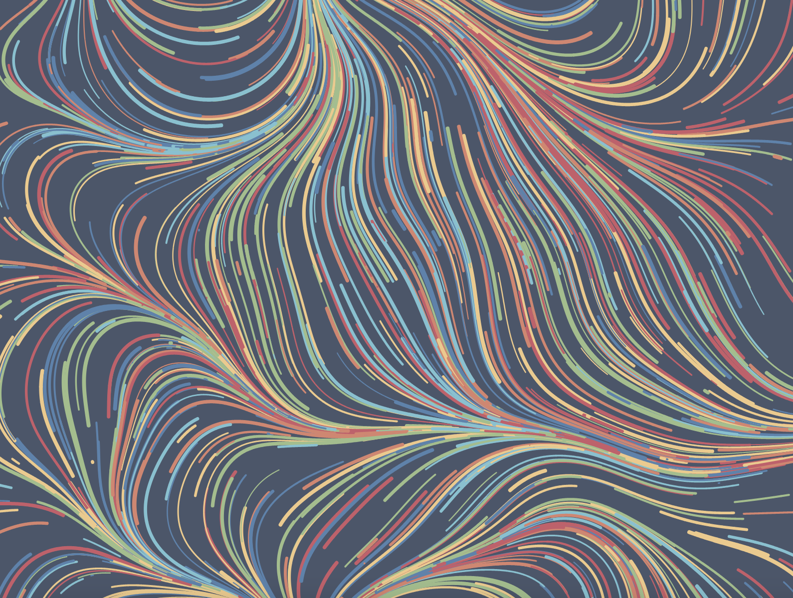
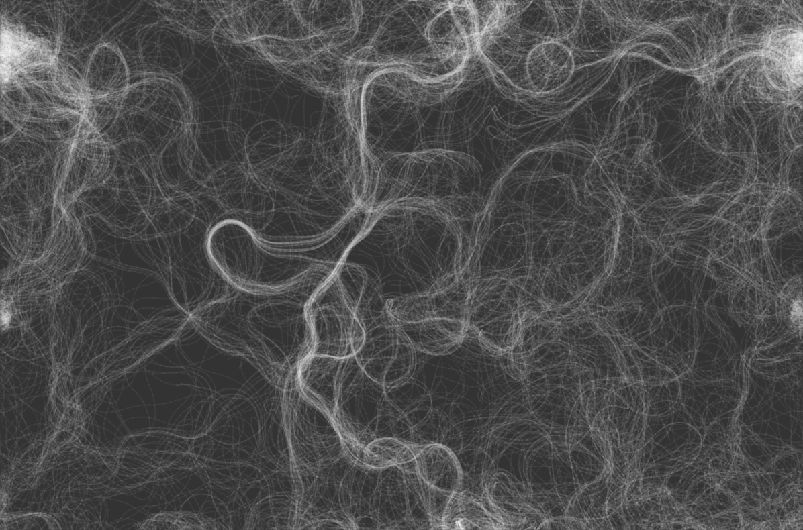

# zmei6507_9103_TUT4

# Quiz 8
## Part 1

**I'll choose The Scream. The two imaging techniques came from the film Vertigo, and another painting by Edvard Munch, Anxiety. It should be stated that the spiral lines in Vertigo do not represent the visual effect of the final design of my project, but the film’s use of color psychology and graphic psychology that inspired me. Just like Anxiety is the embodiment of another emotion drawn by Edvard Munch. I wanted to animate the movement, direction, and color of the lines to simulate the essence of The Scream, which is to express feelings of worry and fear.**

## Part 2

[Link Text](https://github.com/vharivinay/Flow-field-using-noise)
[Link Text](https://vharivinay.xyz/generative/flowfiled/)

**Generating Flow Fields with Perlin Noise as coding technique that helped me realize my main design concept, which is to suggest and visualize an unsettling emotional state through the movement and direction of twisted lines to simulate the nature of The Scream. (Like the distorted clouds and lakes in the background of The Scream.) An example of the coding technique is shown in the picture. I will adjust the Noise Scale and Noise Strength to explore the best effect that meets my expectations and adjust the color of the lines according to the original painting of The Scream.**
