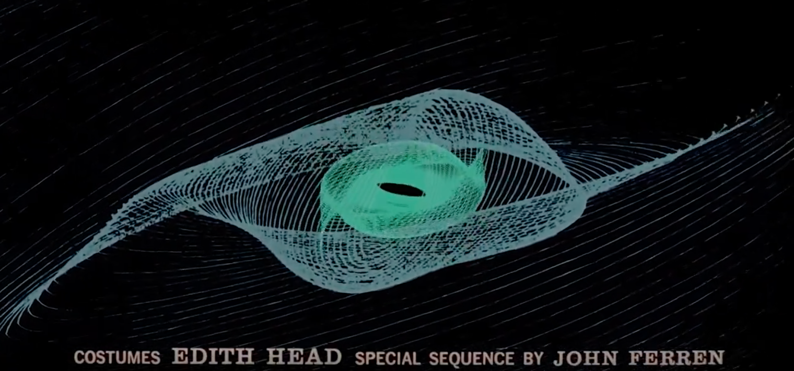
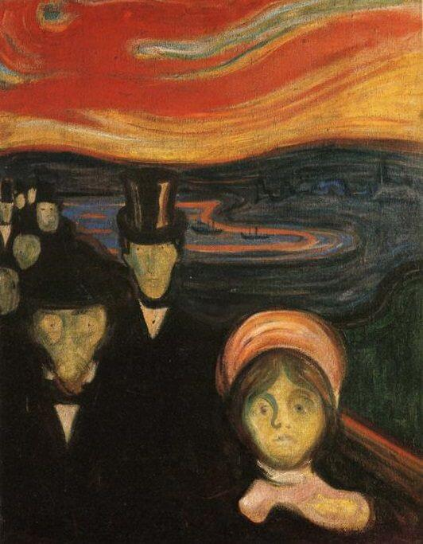
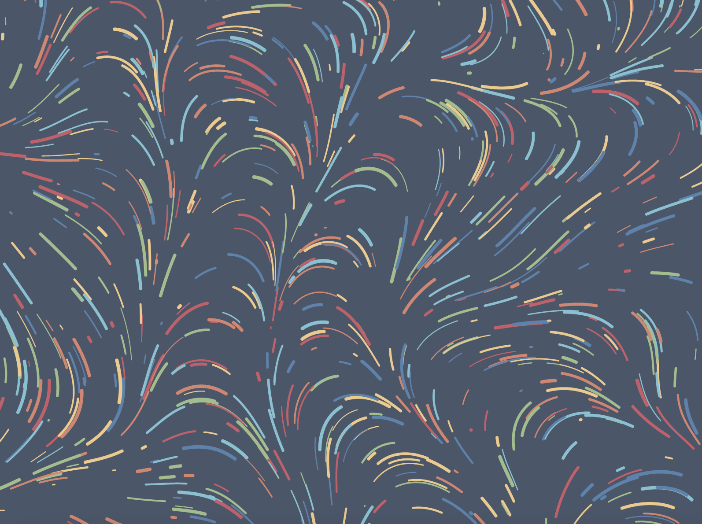

# zmei6507_9103_TUT4

# Quiz 8
## Part 1

**I'll choose The Scream. The two imaging techniques came from the film Vertigo, and another painting by Edvard Munch, Anxiety. It should be stated that the spiral lines in Vertigo do not represent the visual effect of the final design of my project, but the film’s use of color psychology and graphic psychology that inspired me. Just like Anxiety is the embodiment of another emotion drawn by Edvard Munch. I wanted to animate the movement, direction, and color of the lines to simulate the essence of The Scream, which is to express feelings of worry and fear.**

